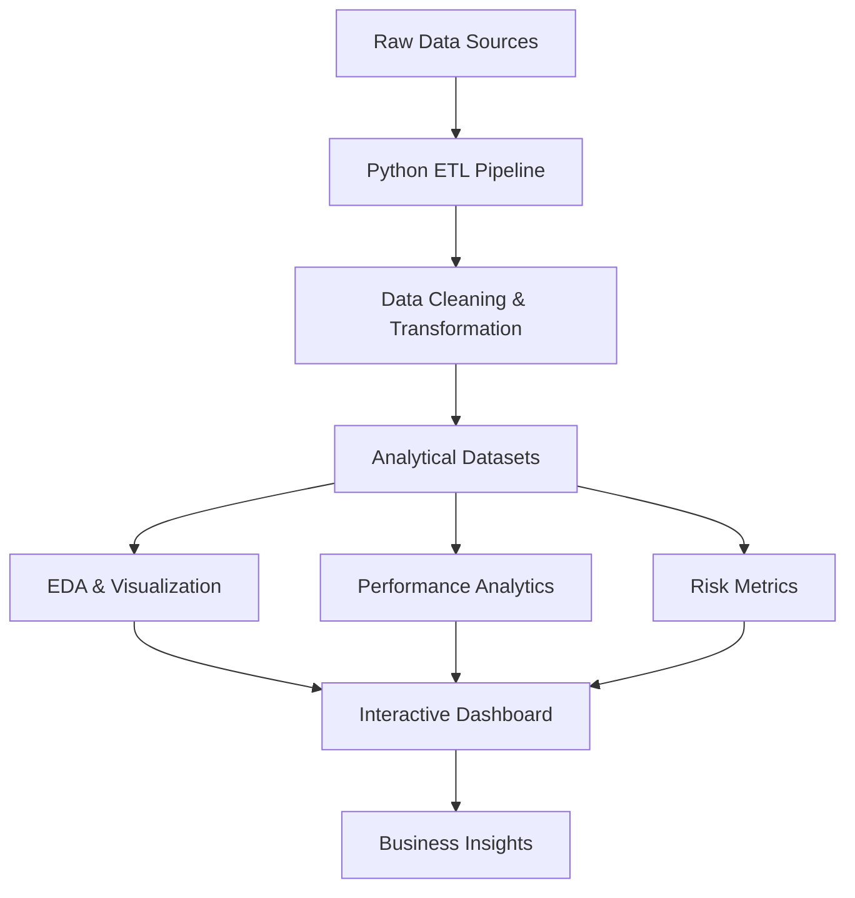
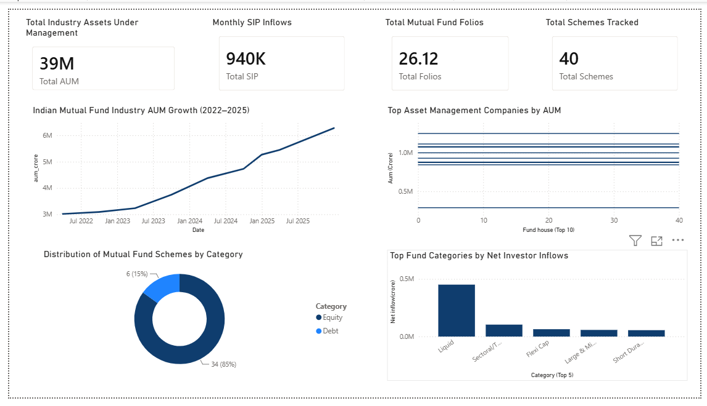
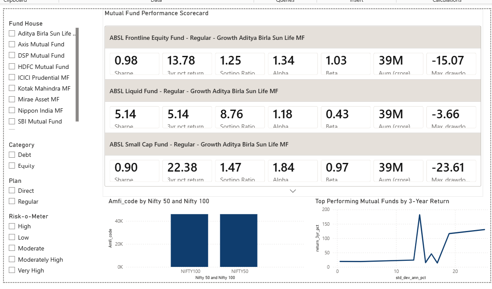
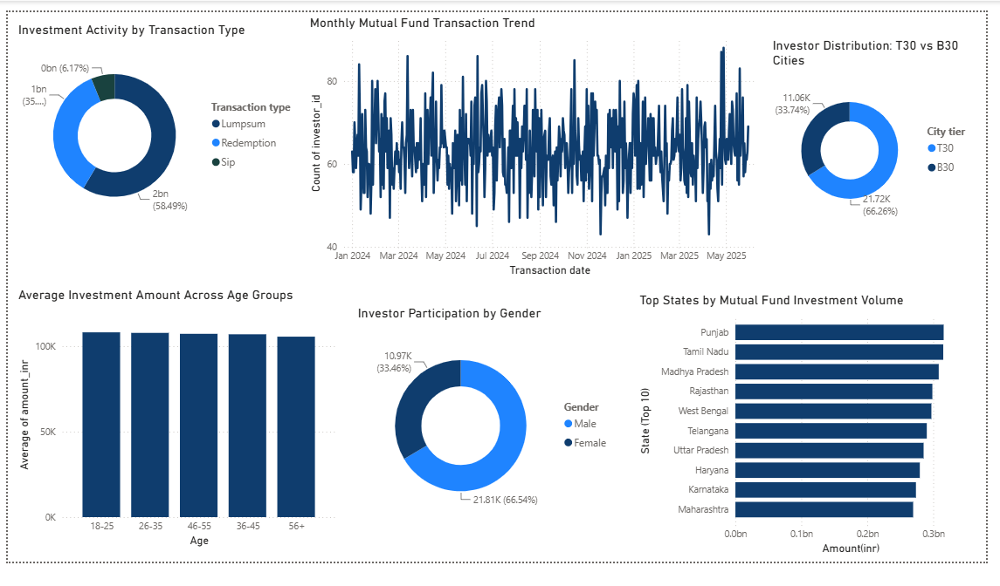
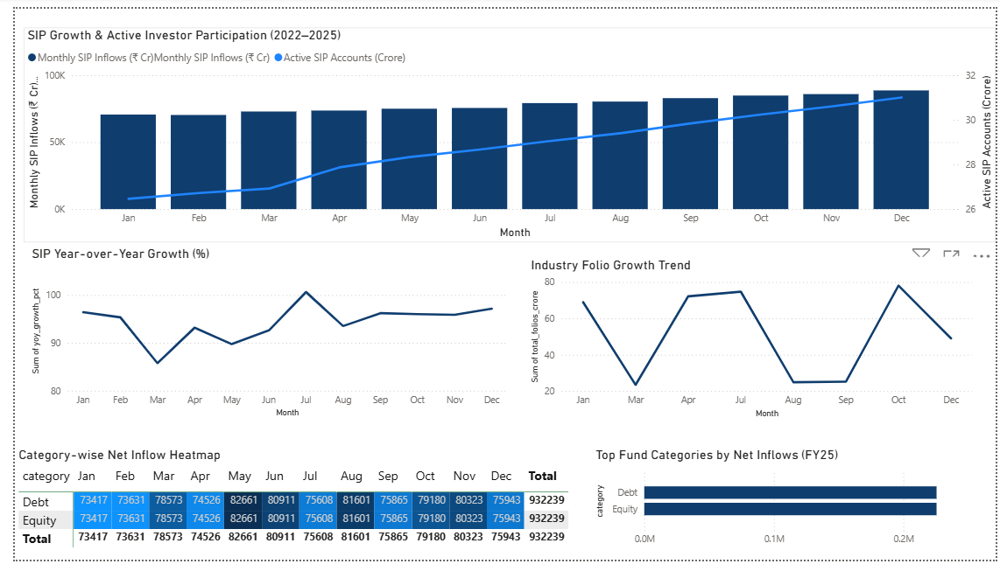

# Mutual Fund Analytics Platform
End-to-End Data Engineering, ETL Pipeline & Interactive Dashboard


---

## 1. Project Overview

This project builds a Mutual Fund Analytics Platform designed to turn raw mutual fund data into actionable investor intelligence.

- **Business problem:** Mutual fund investors struggle with fragmented data, inconsistent performance metrics, and limited visibility into fund risk, SIP trends, and portfolio holdings.
- **Project purpose:** Create a consolidated analytics workflow that ingests, cleans, transforms, analyzes, and visualizes mutual fund data for business decision-making.
- **Why mutual fund analytics matters:** Investors and fund managers require clear performance comparisons, risk profiling, SIP growth insights, and market context to optimize portfolio allocation and product recommendations.
- **Overall solution built:** A complete data engineering pipeline that converts raw CSV and external NAV API data into cleaned datasets, SQL-ready star schema, exploratory analytics, risk metrics, fund scorecards, a recommendation engine, and a Power BI dashboard.

---

## 2. Project Objectives

This repository delivers a full analytics lifecycle for mutual fund data:

- **Data ingestion**
  - Raw datasets loaded from `data/raw/`
  - Live NAV ingestion via `scripts/01_live_fetch_nav.py`
- **ETL pipeline**
  - Notebook-driven ingestion and transformation
  - SQL schema design in `sql/schema.sql`
- **Data cleaning**
  - Standardization of column names and date parsing
  - Duplicate removal, missing-value handling, and validation rules
- **Exploratory Data Analysis**
  - NAV trends, AUM growth, SIP inflows, category heatmaps
  - Investor demographic and geographic analysis
- **Performance analytics**
  - CAGR, alpha, beta, Sharpe ratio, Sortino ratio, standard deviation
  - Fund scorecard generation and benchmark comparison
- **Investor analytics**
  - Transaction behavior, age group analysis, gender split, city tier segmentation
- **Dashboard development**
  - Power BI dashboard file and screenshots in `dashboard/`
- **Business recommendations**
  - Insight-driven guidance for fund selection, SIP campaigns, and risk management

---

## 3. Project Architecture



### Architecture workflow
- **Raw Data Sources**
  - `data/raw/` CSV files
  - Live NAV fetch from `mfapi.in`
- **Python ETL Pipeline**
  - `notebooks/01_Data_Ingestion.ipynb`
  - `notebooks/02_Data_Cleaning.ipynb`
  - `scripts/01_live_fetch_nav.py`
- **Data Cleaning & Transformation**
  - Data standardization
  - Date parsing
  - Numeric validation
  - Duplicate / invalid row removal
- **Analytical Datasets**
  - `data/processed/clean_*.csv`
- **EDA & Visualization**
  - `notebooks/03_EDA_Analysis.ipynb`
- **Performance Analytics**
  - `notebooks/04_Performance_Analysis.ipynb`
  - `reports/performance/*.csv`
- **Risk Metrics**
  - `notebooks/05_portfolio_analytics.ipynb`
  - `reports/Portfolio Analysis/var_cvar_report.csv`
- **Power BI Dashboard**
  - `dashboard/Bluestocks_mf.pbix`
  - `dashboard/Dashboard Screenshots/`
- **Business Insights**
  - Final recommendations and portfolio guidelines

---

## 4. Repository Structure

```
CapstoneProject_1/
├── dashboard/
│   ├── Bluestocks_mf.pbix
│   ├── Bluestocks_mf.pdf
│   └── Dashboard Screenshots/
│       ├── Page 1.png
│       ├── Page 2.png
│       ├── Page 3.png
│       └── Page 4.png
├── data/
│   ├── db/
│   │   └── bluestock_mf.db
│   ├── live_nav/
│   │   ├── all_live_nav.csv
│   │   ├── AXIS_BLUECHIP.csv
│   │   ├── ...
│   ├── processed/
│   │   ├── clean_01_fund_master.csv
│   │   ├── clean_02_nav_history.csv
│   │   └── ...
│   └── raw/
│       ├── 01_fund_master.csv
│       ├── 02_nav_history.csv
│       └── ...
├── notebooks/
│   ├── 00_Database_Setup.ipynb
│   ├── 01_Data_Ingestion.ipynb
│   ├── 02_Data_Cleaning.ipynb
│   ├── 03_EDA_Analysis.ipynb
│   ├── 04_Performance_Analysis.ipynb
│   ├── 05_portfolio_analytics.ipynb
│   └── db_final.ipynb
├── reports/
│   ├── charts/
│   ├── performance/
│   │   ├── alpha_beta.csv
│   │   ├── cagr_report.csv
│   │   ├── fund_scorecard.csv
│   │   ├── sortino_report.csv
│   │   └── tracking_error.csv
│   └── Portfolio Analysis/
│       └── var_cvar_report.csv
├── scripts/
│   ├── 01_live_fetch_nav.py
│   ├── recommender.py
│   └── run_sql.py
├── sql/
│   ├── queries.sql
│   └── schema.sql
├── requirements.txt
└── stocks/
    └── [Python virtual environment]
```

### Folder purpose
- `dashboard/`: Power BI dashboard and screenshot deliverables.
- `data/raw/`: Original source datasets.
- `data/processed/`: Cleaned analytics-ready CSV files.
- `data/live_nav/`: Live NAV fetch outputs for selected schemes.
- `data/db/`: SQLite analytics database.
- `notebooks/`: End-to-end ETL, analysis, performance, and portfolio notebooks.
- `reports/`: Generated scorecards, charts, and risk reports.
- `scripts/`: Utility scripts for NAV fetching, fund recommendation, and SQL queries.
- `sql/`: Database schema and query definitions.
- `stocks/`: Python environment folder.

---

## 5. Data Sources

### Fund Master
- **File name:** `data/raw/01_fund_master.csv`
- **Purpose:** Master scheme metadata and fund attributes.
- **Key columns:** `amfi_code`, `fund_house`, `scheme_name`, `category`, `sub_category`, `plan`, `launch_date`, `benchmark`, `expense_ratio_pct`, `risk_category`
- **Number of records:** 40

### NAV History
- **File name:** `data/raw/02_nav_history.csv`
- **Purpose:** Daily net asset values for fund performance analysis.
- **Key columns:** `amfi_code`, `date`, `nav`
- **Number of records:** 46,000

### AUM
- **File name:** `data/raw/03_aum_by_fund_house.csv`
- **Purpose:** Fund house asset under management trends over time.
- **Key columns:** `date`, `fund_house`, `aum_lakh_crore`, `aum_crore`, `num_schemes`
- **Number of records:** 90

### SIP Inflows
- **File name:** `data/raw/04_monthly_sip_inflows.csv`
- **Purpose:** Monthly SIP inflow growth and investor participation.
- **Key columns:** `month`, `sip_inflow_crore`, `active_sip_accounts_crore`, `new_sip_accounts_lakh`, `sip_aum_lakh_crore`, `yoy_growth_pct`
- **Number of records:** 48

### Category Inflows
- **File name:** `data/raw/05_category_inflows.csv`
- **Purpose:** Category-level mutual fund inflow performance.
- **Key columns:** `month`, `category`, `net_inflow_crore`
- **Number of records:** 144

### Folio Counts
- **File name:** `data/raw/06_industry_folio_count.csv`
- **Purpose:** Investor folio count trends by asset types.
- **Key columns:** `month`, `total_folios_crore`, `equity_folios_crore`, `debt_folios_crore`, `hybrid_folios_crore`, `others_folios_crore`
- **Number of records:** 21

### Scheme Performance
- **File name:** `data/raw/07_scheme_performance.csv`
- **Purpose:** Precomputed scheme performance and risk statistics.
- **Key columns:** `amfi_code`, `scheme_name`, `fund_house`, `category`, `plan`, `return_1yr_pct`, `return_3yr_pct`, `return_5yr_pct`, `benchmark_3yr_pct`, `alpha`, `beta`, `sharpe_ratio`, `sortino_ratio`, `std_dev_ann_pct`, `max_drawdown_pct`, `aum_crore`, `risk_grade`
- **Number of records:** 40

### Investor Transactions
- **File name:** `data/raw/08_investor_transactions.csv`
- **Purpose:** Transaction-level investor behavior data.
- **Key columns:** `investor_id`, `transaction_date`, `amfi_code`, `transaction_type`, `amount_inr`, `state`, `city`, `city_tier`, `age_group`, `gender`
- **Number of records:** 32,778

### Portfolio Holdings
- **File name:** `data/raw/09_portfolio_holdings.csv`
- **Purpose:** Scheme-level stock allocation and sector exposures.
- **Key columns:** `amfi_code`, `stock_symbol`, `stock_name`, `sector`, `weight_pct`, `market_value_cr`, `current_price_inr`, `portfolio_date`
- **Number of records:** 322

### Benchmark Indices
- **File name:** `data/raw/10_benchmark_indices.csv`
- **Purpose:** Market benchmark values for fund comparison.
- **Key columns:** `date`, `index_name`, `close_value`
- **Number of records:** 8,050

---

## 6. ETL Pipeline

### Data ingestion
- Raw CSV files are loaded from `data/raw/`.
- Live NAV data is collected via `scripts/01_live_fetch_nav.py`.
- Notebook-driven ingestion ensures consistency and reproducibility.

### Cleaning
- Standardizes column names and trims string values.
- Removes duplicate rows and invalid values.
- Parses date columns and converts numeric columns using `pd.to_datetime()` and `pd.to_numeric()`.
- Specific cleaning rules:
  - `02_nav_history.csv`: date parsing, forward fill missing NAV per fund, remove non-positive NAV records.
  - `08_investor_transactions.csv`: normalize transaction types and filter invalid amounts.
  - `07_scheme_performance.csv`: numeric conversion for return and expense ratio fields.

### Validation
- Data quality profiling captures missing values and duplicates.
- `notebooks/02_Data_Cleaning.ipynb` reports row counts and dataset integrity metrics.
- Database schema in `sql/schema.sql` enforces referential integrity for dimensions and fact tables.

### Transformation
- Cleaned outputs are written to `data/processed/clean_*.csv`.
- `notebooks/00_Database_Setup.ipynb` loads processed data into a SQLite warehouse.
- Star schema tables include:
  - `dim_fund`
  - `dim_date`
  - `fact_nav`
  - `fact_transactions`
  - `fact_performance`
  - `fact_aum`

### Feature engineering
- Daily returns for NAV series
- Rolling Sharpe ratio
- CAGR windows (1Y / 3Y / 5Y)
- VaR / CVaR risk measures
- Cohort year by investor first transaction
- Expense ratio flags and risk grade validations

### Output generation
- Cleaned CSV datasets in `data/processed/`
- SQLite database `data/db/bluestock_mf.db`
- Performance reports in `reports/performance/`
- Risk report in `reports/Portfolio Analysis/`
- Power BI dashboard file and screenshots

---

## 7. Exploratory Data Analysis

Key analytical areas explored in `notebooks/03_EDA_Analysis.ipynb`:

- **Investor demographics**
  - Age group distributions
  - Gender split
  - Investor cohorts by first transaction year
- **Gender analysis**
  - Transaction count and volume by gender
  - Fund participation across male / female segments
- **City tier analysis**
  - T30 vs B30 city contributions
  - State-level transaction volume
- **NAV trends**
  - Daily NAV trend across schemes
  - Average industry NAV movement
  - NAV distribution across funds
- **AUM analysis**
  - Fund house AUM ranking
  - Year-on-year AUM growth for top AMCs
- **SIP growth**
  - Monthly SIP inflow trend
  - Active SIP account growth
  - SIP YoY growth momentum
- **Sector allocation**
  - Portfolio holdings sector exposure
  - Concentration in top equity sectors
- **Category inflows**
  - Net inflows by fund category
  - Heatmap of category inflows over time

### Dashboard screenshot previews









---

## 8. Performance Analytics

The project implements these key metrics:

- **CAGR**
  - Computed using NAV at the start and end of the period.
  - 1-year, 3-year, and 5-year CAGR are analyzed.
- **Alpha**
  - Fund excess return relative to benchmark regression intercept.
  - Annualized from daily return regression against NIFTY100.
- **Beta**
  - Market sensitivity of fund returns relative to benchmark returns.
  - Calculated from linear regression slope.
- **Sharpe Ratio**
  - Annualized risk-adjusted return using daily return mean and standard deviation.
  - Risk-free rate proxy: 6.5% p.a.
- **Sortino Ratio**
  - Downside-risk adjusted performance using negative return volatility.
- **Standard Deviation**
  - Annualized volatility of daily returns.
- **Maximum Drawdown**
  - Peak-to-trough NAV drawdown measure used for downside risk.

These performance analytics appear in the notebook analysis, fund scorecards, and `reports/performance/` outputs.

---

## 9. Dashboard Overview

The Power BI dashboard is designed as a multi-page executive dashboard.

### Page 1 – Industry Overview
- **KPIs:** Total AUM, monthly SIP inflows, fund house ranking, category inflows.
- **Visuals:** AUM bar charts, NAV trend line, category inflow heatmap.
- **Filters:** Date selectors, fund house, category.
- **Business value:** Helps leadership identify which categories and AMCs drive industry growth.

### Page 2 – Fund Performance
- **KPIs:** CAGR, Sharpe ratio, alpha, beta, portfolio returns.
- **Visuals:** Performance scorecards, benchmark comparison trends, top fund performance tables.
- **Filters:** Risk grade, benchmark index, fund family.
- **Business value:** Supports fund selection and product positioning using risk-adjusted metrics.

### Page 3 – Investor Analytics
- **KPIs:** Gender split, age profile, city tier share, cohort investor counts.
- **Visuals:** Demographic charts, transaction volumes by state, city tier pie charts.
- **Filters:** Investor segment, geography, transaction type.
- **Business value:** Enables customer segmentation and targeted SIP campaigns.

### Page 4 – SIP & Market Trends
- **KPIs:** SIP inflow growth, active SIP accounts, benchmark market direction.
- **Visuals:** Monthly SIP trend lines, YoY growth, benchmark overlay.
- **Filters:** Time window, scheme selection, benchmark series.
- **Business value:** Tracks SIP momentum and links fund performance to market conditions.

---

## 10. Key Findings

1. Industry NAV shows a sustained upward trend across the fund universe.
2. Top fund houses capture the largest AUM share, with a small set of AMCs dominating market scale.
3. SIP inflows are consistently rising, indicating strong retail participation over time.
4. Category inflows show clear leadership among equity categories, with select themes attracting the most capital.
5. Investor transactions are concentrated in T30 cities, but B30 cities still contribute meaningful growth.
6. Male investors remain the majority, while female investor participation is material and growing.
7. Age group analysis points to the 30-45 cohort as the most active SIP investor segment.
8. Risk-adjusted metrics identify funds with high Sharpe and Sortino scores vs. peers.
9. Alpha/Beta calculations reveal which funds outperform benchmarks while managing market sensitivity.
10. VaR and CVaR reports highlight funds with elevated downside exposure.
11. Portfolio holdings show sector concentration in core large-cap stocks.
12. Cleaned datasets reduce missing values and duplicates, improving analytics reliability.
13. Expense ratio validation reveals funds requiring cost monitoring.
14. Live NAV ingestion enables near-real-time tracking for selected bluechip schemes.
15. Data warehouse modeling supports SQL analytics and business intelligence queries.

---

## 11. Business Recommendations

- Prioritize moderate-risk funds with strong Sharpe and alpha performance in investor communications.
- Use SIP growth insights to target campaigns at younger cohorts and high-potential city tiers.
- Monitor category inflow leaders to identify product repositioning and sector-focused fund launches.
- Incorporate risk metrics like VaR/CVaR and max drawdown into investor-facing dashboards.
- Develop dynamic fund scorecards for fund managers, emphasizing risk-adjusted returns.
- Expand live NAV capture to a broader fund universe for more timely decision support.
- Automate clean data refresh and database load for faster dashboard updates.
- Use portfolio holdings analysis to manage sector concentration and maintain diversification.
- Track expense ratios and risk grade flags as part of ongoing fund governance.
- Leverage benchmark comparisons to step up competitive positioning against NIFTY indices.

---

## 12. Technologies Used

| Technology | Purpose | Version (when identifiable) |
|---|---|---|
| Python | Data engineering and analytics | 3.13 (project env) |
| pandas | Data loading, cleaning, modeling | N/A |
| NumPy | Numerical computation | N/A |
| Matplotlib | Static charts and plots | N/A |
| Seaborn | Statistical visualizations | N/A |
| Plotly | Interactive charting | N/A |
| SciPy | Regression and statistical calculations | N/A |
| SQL / SQLite | Data warehousing and analytics | N/A |
| Power BI | Interactive dashboard | N/A |
| Jupyter Notebook | Exploratory analysis and reporting | N/A |
| Git | Version control | N/A |
| GitHub | Repository management | N/A |

> `requirements.txt` includes package dependencies such as `certifi==2026.5.20`, `charset-normalizer==3.4.7`, `contourpy==1.3.3`, `cycler==0.12.1`, and `fonttools==4.63.0`.

---

## 13. Installation & Setup

1. **Clone repository**
   ```bash
   git clone https://github.com/saiKhedekar/CapstoneProject_1.git
   cd CapstoneProject_1
   ```

2. **Create Python environment**
   ```bash
   python -m venv .venv
   .venv\\Scripts\\activate
   ```

3. **Install dependencies**
   ```bash
   pip install -r requirements.txt
   ```
   If encoding issues occur, use:
   ```bash
   pip install pandas numpy matplotlib seaborn plotly scipy sqlalchemy requests notebook
   ```

4. **Run ETL notebooks**
   - Open `notebooks/01_Data_Ingestion.ipynb`
   - Run `notebooks/02_Data_Cleaning.ipynb`
   - Execute `notebooks/00_Database_Setup.ipynb`

5. **Generate analytics**
   - Run `notebooks/03_EDA_Analysis.ipynb`
   - Run `notebooks/04_Performance_Analysis.ipynb`
   - Run `notebooks/05_portfolio_analytics.ipynb`

6. **Refresh live NAV**
   ```bash
   python scripts/01_live_fetch_nav.py
   ```

7. **Use the recommender**
   ```bash
   python scripts/recommender.py
   ```

8. **Open dashboard**
   - Open `dashboard/Bluestocks_mf.pbix` in Power BI Desktop
   - Review screenshot overview in `dashboard/Dashboard Screenshots/`

---

## 14. Project Deliverables

- **ETL Pipeline**
  - Notebook-driven ingestion and cleaning flow
  - SQL star schema in `sql/schema.sql`
- **Cleaned Datasets**
  - `data/processed/clean_01_*` through `clean_10_*`
- **EDA Analysis**
  - `notebooks/03_EDA_Analysis.ipynb`
- **Performance Analysis**
  - `notebooks/04_Performance_Analysis.ipynb`
  - `reports/performance/*.csv`
- **Portfolio Analytics**
  - `notebooks/05_portfolio_analytics.ipynb`
  - `reports/Portfolio Analysis/var_cvar_report.csv`
- **Power BI Dashboard**
  - `dashboard/Bluestocks_mf.pbix`
  - `dashboard/Bluestocks_mf.pdf`
- **Final Report Assets**
  - Charts and CSV summaries in `reports/`
- **Recommendation Engine**
  - `scripts/recommender.py`
- **Live NAV Fetch**
  - `scripts/01_live_fetch_nav.py`
  - `data/live_nav/`

---

## 15. Future Enhancements

- Add automated daily refresh of live NAV data for all schemes.
- Introduce time-series forecasting for SIP inflows and AUM growth.
- Build a web dashboard or Streamlit app for dynamic investor self-service.
- Expand the database model to handle additional scheme-level lifecycle metrics.
- Add sentiment or macroeconomic data for enhanced performance context.
- Implement advanced portfolio optimization and recommendation algorithms.
- Deploy the analytics pipeline in a cloud-native environment.
- Add automated testing and data quality monitoring for ETL jobs.

---

## 16. Author

**Sai Khedekar**  
Project: Mutual Fund Analytics Platform  
GitHub: [https://github.com/saiKhedekar/CapstoneProject_1](https://github.com/saiKhedekar/CapstoneProject_1)
